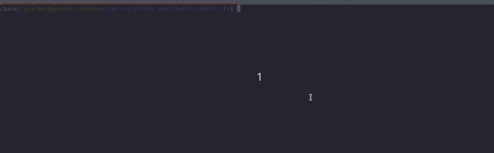

# Devto a cli for dev.to 

This is a work in progress so don't a expect a full support for [Dev API(beta)](https://docs.forem.com/api/).

# Table of contents
- [Devto a cli for dev.to](#devto-a-cli-for-devto)
- [Table of contents](#table-of-contents)
- [Build](#build)
- [Install](#install)
- [Manpage](#manpage)
- [Operations that can be performed](#operations-that-can-be-performed)
  * [Articles](#articles)
  * [Comments](#comments)
  * [Tags](#tags)
  * [Followers](#followers)
  * [Listings](#listings)
  * [Organizations](#organizations)
  * [Podcasts](#podcasts)
  * [Reading Lists](#reading-lists)
  * [Webhooks](#webhooks)
  * [Profile Images](#profile-images)
- [Commands](#commands)
  * [Auth](#auth)
  * [Articles](#articles-1)
  * [Comments](#comments-1)
  * [Tags](#tags-1)
  * [Followers](#followers-1)
  * [Listings](#listings-1)
  * [Organizations](#organizations-1)
  * [Podcasts](#podcasts-1)
  * [Reading Lists](#reading-lists-1)
  * [Webhooks](#webhooks)
  * [Profile Images](#profile-images-1)
- [Valid aclaration](#valid-aclaration)
- [TODO](#todo)

# Build

`make build`
or
`go build -o devto`

> **NOTE**: `First make sure you have golang installed`

# Install

`make install`

# Manpage
This is just optional

`sudo make manpage`

# Operations that can be performed

## Articles
* Get articles
* Get articles by username
* Get articles with queries
* Get articles by ID
* Get articles with videos
* Get articles of authenticated user
* Get all articles of authenticated user
* Get published articles of authenticated user
* Get unpublished articles of authenticated user
* Create article
* Update article

## Comments
* Retrieve comments on an article or a podcast.
* Retrieve comments with its children comments.

## Tags
* Retrieve all the availables tags. An api_key is required, so make sure you provide one with `auth` command.
* Retrieve tags that I follow. An api_key is required, so make sure you provide one with `auth` command.

## Followers
* Retrieve my followers. An api_key is required, so make sure you provide one with `auth` command.

## Listings
* Retrieve listing availables.
* Create a listing.
* Update a listing.
* Reading a given listing by its id.

## Organizations
* Retrieve organization by username.
* Retrieve users on an organization. 
* Retrieve listing on an organization. 
* Retrieve articles belonging to an organization. 

## Podcasts
* Retrieve podcast availables.

## Reading Lists
* Retrieve reading lists availables.

## Webhooks. Need to be authenticated
* Retrieve webhooks they have previously registered.
* Retrieve webhooks by id
* Create webhooks
* Delete webhook

## Profile Images
* Retrieve retrieve a user or organization profile image information by its corresponding username

# Commands

## Auth
* Store api_key
    * `./devto auth <api_key>`

## Articles
* Retrieve articles
    * `./devto articles`
* Retrieve articles with queries
    * `./devto articles -q`
* Retrieve articles by username
    * `./devto articles gealber`
* Retrieve articles by username with queries
    * `./devto articles gealber -q`
* Retrieve articles by id
    * `./devto articles <id>`
* Retrieve body of an article
    * `./devto articles <id> -b`
* Get articles of authenticated user
    * `./devto articles me`
* Get published articles of authenticated user
    * `./devto articles me -p`
* Get unpublished articles of authenticated user
    * `./devto articles me -up`
* Get all articles of authenticated user
    * `./devto articles me -all`
* Retrieve articles with videos
    * `./devto articles videos`
* Create an article
    * `./devto articles create`
* Update a given article
    * `./devto articles update <id>`

## Comments
* Retrieve comments on article and podcast
    * `./devto comments -a_id <id>`
    * `./devto comments -p_id <id>`
* Retrieve comments given an id.
    * `./devto comments -id <id>`

## Tags
* Retrieve all tags. An api_key is required, so make sure you provide one with `auth` command.
    * `./devto tags`
* Retrieve tags that I follows. An api_key is required, so make sure you provide one with `auth` command.
    * `./devto tags follows`

## Followers
* Retrieve my followers. An api_key is required, so make sure you provide one with `auth` command.
    * `./devto followers`

## Listings
* Retrieve listing availables.
    * `./devto listings`
* Create a listing.
    * `./devto listings create`
* Update a listing.
    * `./devto listings update <id>`
* Reading a given listing by its id.
    * `./devto listings retrieve <id>`

## Organizations
* Retrieve organization by username.
    * `./devto organizations <username>`
* Retrieve users on an organization. 
    * `./devto organizations <username> -u`
* Retrieve listing on an organization. 
    * `./devto organizations <username> -l`
* Retrieve articles belonging to an organization. 
    * `./devto organizations <username> -a`

## Podcasts
* Retrieve podcast availables.
    * `./devto podcasts`

## Reading Lists
* Retrieve podcast availables.
    * `./devto reading_lists`

## Webhooks

> **NOTE**: Need to be authenticated

* Retrieve webhooks they have previously registered.
    * `./devto webhooks`
* Retrieve webhooks by id
    * `./devto webhooks <id>`
* Create webhooks
    * `./devto webhooks create`
* Delete webhook
    * `./devto webhooks delete <id>`

## Profile Images
* Retrieve retrieve a user or organization profile image information by its corresponding username
    * `./devto profile_images <username>`

# Valid aclaration

The field `body_markdown` on operations like the creation of an article, expect a path to a markdown file.
With the content of the article you want to published.

# TODO
From now on, I need to refactor.

1. REFACTOR, REFACTOR AND REFACTOR.
